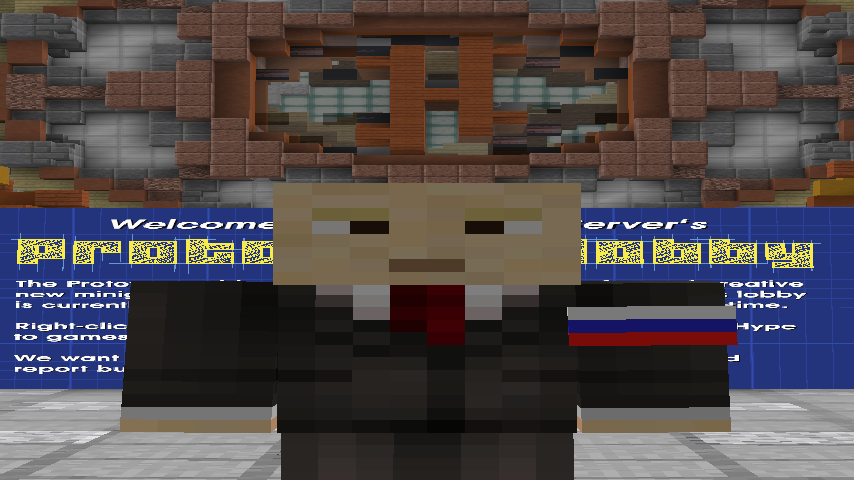

# WidePutin

This Minecraft mod makes things wide.

This mod is configurable using the `/wideputin` command.

Options:
- Enable: Completely enabled or disables the mod
- Widen: Widens the world
- Wideness: Adjust how wide the world gets (in percent)
- Putin Skin: Changes your skin to a putin skin
- Everyone Putin Skin: Changes all other players skin to a putin skin
- Music: Plays the WidePutin music on loop (turning off vanilla music is recommended)
